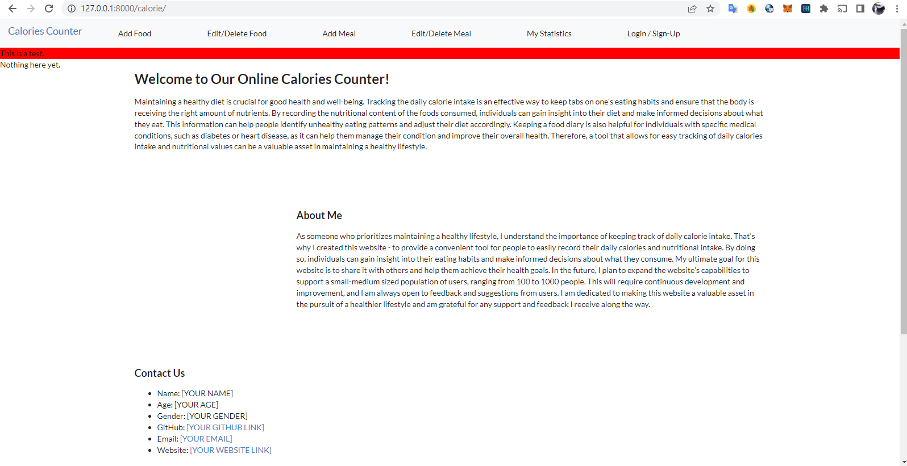
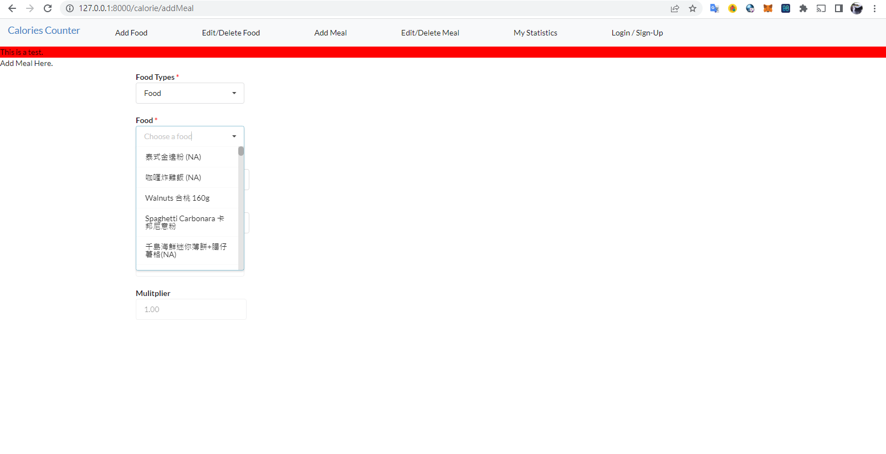
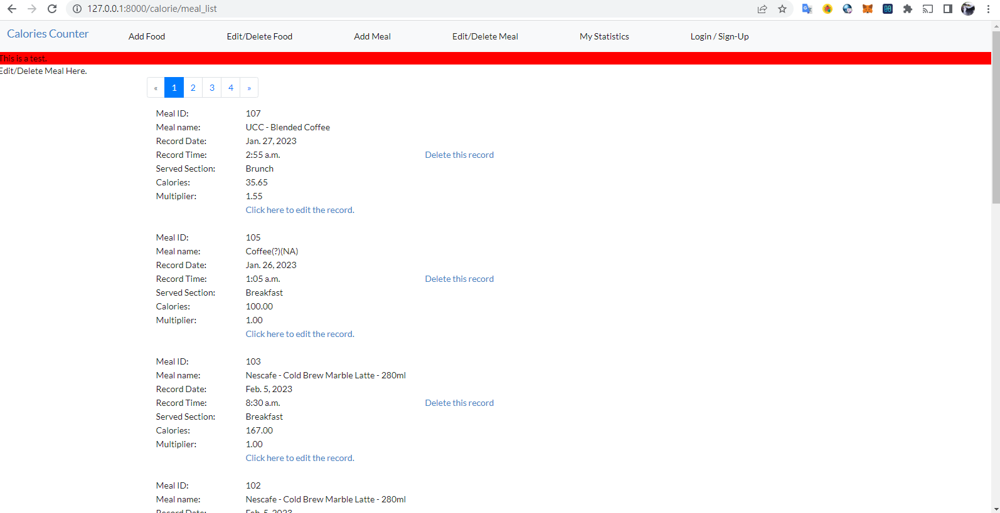

## &nbsp;&nbsp;&nbsp;&nbsp;&nbsp;&nbsp;&nbsp;&nbsp;This is a side-project built with Django to record daily calories intake for myself. However, as per the experience grow, this side project may become a fully-functional website for providing small-medium size of user-login, user-recording, user-reporting on their calories intakes everyday.
 

### Road Map
&nbsp;&nbsp;&nbsp;&nbsp;More like a to-do-list than a road map actually:
<table style="width:100%">
    <tbody>
        <tr>
            <th style="width:120px">Completed:</th><th></th><th></th><th></th>
        </tr>
        <tr><td style="width:120px"></td><td style="width:1px; vertical-align: top;">&bull;</td><td style="width:170px; vertical-align: top;"><b>Add Meal Page:</b></td><td>Record a meal to db.</td></tr>
        <tr><td style="width:120px"></td><td style="width:1px; vertical-align: top;">&bull;</td><td style="width:170px; vertical-align: top;"><b>Meal List Page:</b></td><td>List each recorded meal in tabular representation and allow user to delete recorded meal.</td></tr>
        <tr><td style="width:120px"></td><td style="width:1px; vertical-align: top;">&bull;</td><td style="width:170px; vertical-align: top;"><b>Meal Detail Page:</b></td><td>List recorded meal detail info and allow user to edit some attributes of that single record.</td></tr>
        <tr><td style="width:120px"></td><td style="width:1px; vertical-align: top;">&bull;</td><td style="width:170px; vertical-align: top;"><b>Add Food Page:</b></td><td>Record a food and nutri. info to db for recording a meal.</td></tr>
        <tr><td style="width:120px"></td><td style="width:1px; vertical-align: top;">&bull;</td><td style="width:170px; vertical-align: top;"><b>Food List Page:</b></td><td>List each recorded food in tabular representation and allow user to delete recorded food.</td></tr>
        <tr>
            <th style="width:120px">To Complete:</th><th></th>
        </tr>
        <!-- <tr><td style="width:120px"></td><td style="width:1px; vertical-align: top;">&bull;</td><td style="width:170px; vertical-align: top;"><b>:</b></td><td></td></tr> -->
        <tr><td style="width:120px"></td><td style="width:1px; vertical-align: top;">&bull;</td><td style="width:170px; vertical-align: top;"><b>Food Detail Page:</b></td><td>List recorded food detail info and allow user to edit some attributes of that food record.</td></tr>
        <tr><td style="width:120px"></td><td style="width:1px; vertical-align: top;">&bull;</td><td style="width:170px; vertical-align: top;"><b>User Login/Sign-up Page:</b></td><td>Upgrade the schema to support user personal record, and add a login/sign-up page for user.</td></tr>
        <tr><td style="width:120px"></td><td style="width:1px; vertical-align: top;">&bull;</td><td style="width:170px; vertical-align: top;"><b>Statistics Page:</b></td><td>Provide user to view their recorded meal and info in a graphical representation.</td></tr>
        <tr><td style="width:120px"></td><td style="width:1px; vertical-align: top;">&bull;</td><td style="width:170px; vertical-align: top;"><b>Deployment:</b></td><td>TBC.</td></tr>
        <tr>
            <th style="width:120px">Improvements:</th><th></th>
        </tr>
        <!-- <tr><td style="width:120px"></td><td style="width:1px; vertical-align: top;">&bull;</td><td style="width:170px; vertical-align: top;"><b>:</b></td><td></td></tr> -->
        <tr><td style="width:120px"></td><td style="width:1px; vertical-align: top;">&bull;</td><td style="width:170px; vertical-align: top;"><b>Form validation:</b></td><td>Form validation for addMeal and addFood pages.</td></tr>
    </tbody>
</table>
 

### Change Log

2023-02-23: 1st commit to github. 
2023-03-02: readme update. 
2023-03-05: Add Food Page & Food List Page updated. 
2023-03-06: readme & photo update. 
2023-04-06: Update food detail page (WIP) 
 

### Screen Captures

<!--  -->

